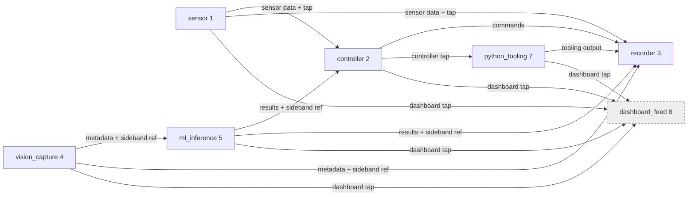

# Deployment profiles

> **Phase F F1 deliverable** (peer 7 added in F2). Operator-facing companion to the four TOML profiles under [`config/profiles/`](../config/profiles/). Pick the right profile for the host, understand the trade-offs each one bakes in, and know where the documented gaps are.

## Profile selector

| Host shape | Profile | Transport | Use when |
|------------|---------|-----------|----------|
| **NVIDIA Jetson on a robot** (L4T) | [`jetson_prod.toml`](../config/profiles/jetson_prod.toml) | SHM (all peers) | Embedded compute; lowest-latency local IPC; CSI / V4L cameras + CUDA inference + control loop co-located |
| **x86 dev laptop / workstation** | [`x86_dev.toml`](../config/profiles/x86_dev.toml) | UDS (all peers) | Local iteration; debugging; running a Python or Node bridge against the router; tracing with `strace` / `tcpdump` (UDS-aware) |
| **Hardware-in-the-loop bench** | [`hil.toml`](../config/profiles/hil.toml) | UDP loopback (`127.0.0.1`) | Plant replaced by mocks; deterministic injection; tools that need a recordable UDP wire (e.g. `tcpdump -i lo`) |
| **Cloud / CI simulation** | [`sim_cloud.toml`](../config/profiles/sim_cloud.toml) | UDP across a container subnet | Multi-container test deployment; cross-machine SHM is not supported by the module ([ADR 0005](adr/0005-payload-policy-and-sideband.md)) |

**Swapping rule:** peer IDs and route rules are identical across all four profiles. Only the transport scheme + address strings change. A peer binary built against the demo `router_client` interface works against any profile by passing `--config <profile>.toml` to the router and a transport-matched address to the client.

## Peer catalog

All four profiles declare the same seven peers, with stable IDs per the [SYSTEM-VISION.md catalog](../robotics-ipc-module/SYSTEM-VISION.md#peer-catalog-illustrative) and [E1 reference layout](robotics-reference-layout.md#peer-catalog):

| ID | Name | Phase status | Role |
|----|------|--------------|------|
| 1 | `sensor` | Demo binary today | IMU / proprioceptive aggregate; small periodic frames |
| 2 | `controller` | Demo binary today | Control loop; subscribes sensor + ml; publishes commands |
| 3 | `recorder` | Demo binary today | Black-box log (CSV); subscribe-all via routes |
| 4 | `vision_capture` | Sketch — Phase F F5 | CSI/V4L camera pipeline; metadata frames + NV12 sideband |
| 5 | `ml_inference` | Sketch — Phase F F5 | CUDA / TensorRT engine; metadata frames + tensor sidebands |
| 7 | `python_tooling` | **Implemented — Phase F F2** ([`examples/bridges/python_peer/`](../examples/bridges/python_peer/)) | Python subscriber / publisher; UDS today, ctypes RouterFrame port |
| 8 | `dashboard_feed` | **Implemented** — Phase F F3 ([`examples/bridges/node_gateway/`](../examples/bridges/node_gateway/)) | Node UDP → WebSocket gateway (stdlib only, no `npm install`); reachable on UDP profiles (`hil.toml`, `sim_cloud.toml`); UDS / SHM reachability tracked under parked C11 |

**Peer ID 6 (`mavlink_gateway`) is intentionally absent until F4.** The profile files leave room (port 19106 in `hil.toml`, address `10.0.0.7` in `sim_cloud.toml`) so adding it later does not require renumbering.

## Route topology

Routes are identical across all four profiles (only transport changes). Each rule fans one source out to up to **`kMaxRouteDests` = 8** destinations — the prior 2-destination cap was lifted by [closed C5 Scope A](../robotics-ipc-module/plans/post-phases-robotics-review.md#c5--declarative-transport-layer-gaps). `dashboard_feed` (peer 8) is now a tap on every compute-side rule, closing the F1 dashboard limitation.



In TOML:

```toml
[[routes]]
source = 1                            # sensor    → controller + recorder + dashboard
dest   = [2, 3, 8]

[[routes]]
source = 2                            # controller → recorder + python_tooling + dashboard
dest   = [3, 7, 8]

[[routes]]
source = 4                            # vision_capture → ml_inference + recorder + dashboard
dest   = [5, 3, 8]

[[routes]]
source = 5                            # ml_inference   → controller + recorder + dashboard
dest   = [2, 3, 8]

[[routes]]
source = 7                            # python_tooling → recorder + dashboard
dest   = [3, 8]
```

Recorder (peer 3) remains the central "log + tap" point — every active source has a destination of 3, so the recorder sees the full dataflow. `python_tooling` (peer 7) gets a controller tap via `source = 2 dest = [3, 7, 8]` so the F2 Python bridge can observe the control plane. `dashboard_feed` (peer 8) is a mirror-image tap on every compute-side rule, and the F3 Node gateway ([`examples/bridges/node_gateway/`](../examples/bridges/node_gateway/)) subscribes to the full system view without bridges editing the route table per deployment — it broadcasts each frame to browsers as JSON over WebSocket. Listing peer 8 at the **end** of every `dest` array preserves pre-C5 delivery order to existing destinations (controller / recorder etc. receive first; dashboard last).

## Per-profile shape

### `jetson_prod.toml` (SHM)

**Why all-SHM:** the production target is a single Jetson host running the entire stack co-resident. SHM SPSC rings under `/dev/shm/rim_router_*` are the lowest-latency local IPC available, with per-peer ring sizing ([ADR 0009](adr/0009-per-peer-ring-sizing.md)) keeping each ring inside one cache line per slot.

**Per-peer ring sizing.** Every peer's control-plane ring is `shm_slot_count = 256`, `shm_max_payload = 64` (one `RouterFrame` v2 per slot). Each peer ring footprint is `64 + 2 × 256 × 68 ≈ 35 KiB` of `/dev/shm`.

**Sideband regions.** Two peers declare sideband regions for bulk data (separate SHM segments, [ADR 0005](adr/0005-payload-policy-and-sideband.md)):

| Owner | Region | Size | Class | Purpose |
|-------|--------|------|-------|---------|
| `vision_capture` (4) | `/rim_vision_nv12` | 8 MiB | `vision_nv12` | One 1080p NV12 frame per slot |
| `ml_inference` (5) | `/rim_ml_tensor_in` | 16 MiB | `ml_tensor_in` | Input tensor handed off from vision |
| `ml_inference` (5) | `/rim_ml_tensor_out` | 4 MiB | `ml_tensor_out` | Inference output handed back to controller |

Sideband regions are **owned by the peer**, not the router. The bridge process (vision, ml) creates them with `shm_open` + `ftruncate`; the router transports the descriptors (`sideband_idx` / `sideband_seq` / `sideband_len`) in `RouterFrame` v2 fields and never reads the bulk bytes.

**Cleanup.** Router unlinks-then-creates its own peer rings on bind. Sideband regions persist across router restarts; the [`rim-router-cleanup.sh`](../robotics-ipc-module/deploy/systemd/rim-router-cleanup.sh) helper called by `rim-router.service`'s `ExecStopPost=` proactively `rm -f`s the anticipated `/dev/shm/rim_router_*` and `/dev/shm/rim_vision_*` / `/dev/shm/rim_ml_*` names.

### `x86_dev.toml` (UDS)

**Why UDS:** dev laptops may not have `CAP_IPC_LOCK` or a tmpfs sized for SHM rings, and UDS is plenty fast for non-realtime iteration (`make test-ipc` UDS round-trip ≈ 0.8 M trips/5 s, well above any human-perceptible threshold). UDS is also more debuggable — `strace -e network -p $PID` on a peer is human-readable; SHM atomics in `perf` traces are not.

**Path convention.** `/tmp/rim_router_*.sock`. Production-style x86 deployments (systemd + dedicated `rim` user) typically prefer `/run/rim/`, which is created by `install -d -o rim -g rim /run/rim`. The shipped profile uses `/tmp/` because `/run/` requires root and would break `make test-router`. To migrate, replace the path prefix in the TOML and the `ReadWritePaths=` directive in [`rim-router.service`](../robotics-ipc-module/deploy/systemd/rim-router.service).

**Demo CLI default-path mismatch.** The compile-time demo CLI defaults (`router_client sensor uds` with no explicit path) connect to `/tmp/rim_router_a.sock` per [`router_client_config.h`](../ipc/test/router_client_config.h), **not** to the descriptive paths in `x86_dev.toml`. When using the profile end-to-end, pass explicit paths:

```sh
./build/ipc/test/router_server --config config/profiles/x86_dev.toml &
./build/ipc/test/router_client sensor   uds /tmp/rim_router.sock /tmp/rim_router_sensor.sock &
./build/ipc/test/router_client recorder uds /tmp/rim_router.sock /tmp/rim_router_recorder.sock /tmp/rec.log
```

### `hil.toml` (UDP loopback)

**Why UDP on loopback:** the HIL workbench replaces hardware peers with mock processes. UDP on `127.0.0.1` is the simplest "wire" that survives `tcpdump -i lo -X` and lets a fault-injection tool craft truncated / unknown-source / replay datagrams (covered by [`fault_injection_test.cpp`](../ipc/test/fault_injection_test.cpp) D4 scenarios).

**Port allocation:**

| Peer | Port | Notes |
|------|------|-------|
| router listen | 19100 | |
| sensor (1) | 19101 | |
| controller (2) | 19102 | |
| recorder (3) | 19103 | |
| vision_capture (4) | 19104 | |
| ml_inference (5) | 19105 | |
| _mavlink_gateway (6)_ | _19106_ | _Reserved for F4_ |
| python_tooling (7) | 19107 | Added in F2 (UDP variant not yet wired in [`python_peer/`](../examples/bridges/python_peer/), which is UDS-only today) |
| dashboard_feed (8) | 19108 | |

### `sim_cloud.toml` (UDP, container subnet)

**Why UDP across a container subnet:** the orchestrator (Kubernetes, Docker Compose, etc.) assigns one container per peer. Cross-host SHM is not supported by the module ([ADR 0005](adr/0005-payload-policy-and-sideband.md) — SHM is single-host by definition).

**Address allocation:** `10.0.0.x:1920x` per peer (placeholder; orchestrator overrides). Address `10.0.0.7` is reserved for F4 (`mavlink_gateway`); `python_tooling` (7) lives at `10.0.0.8:19207`.

## Known limitations

These limitations are baked into F1 and will be revisited as Phase F progresses and the parked review surfaces during the post-phases pass. None are profile-file issues — they are router / routing API constraints that the profiles **document honestly** rather than hide.

### Single transport per router instance

The current router architecture is templated on one transport per `RouterServer<T>` instance. `ShmRouterLink::bind_router` silently skips non-SHM peers in the topology; `send_to_peer` throws if a route targets a peer it doesn't have a channel for. **Mixing SHM and UDS peers in one profile crashes the router on the first cross-transport forward.**

Consequence for F1: all six peers in `jetson_prod.toml` ride SHM, even though IO-heavy peers like the recorder (writes log files) and dashboard_feed (bridges to Node.js) would prefer UDS in production. Two workarounds an operator can apply today:

- **Multi-router topology.** Run a second router process with a UDS-only profile, and have one bridge peer subscribe to the SHM router and republish to the UDS router. Not in F1 scope.
- **Native SHM client in Node.js.** Use a small N-API addon to read the SHM ring directly. Heavy but feasible; the wire layout is documented in [ADR 0008](adr/0008-router-frame-v2.md) §RouterFrame v2.

The proper fix — a `MixedTransportRouterLink` that fans out across SHM/UDS/UDP from a single instance, or alternatively a factory-generated bridge daemon pattern between single-transport routers, or peer-side dual-protocol bridges — is captured in [parked review C11 §Mixed-transport networks](../robotics-ipc-module/plans/post-phases-robotics-review.md#c11--mixed-transport-networks) (three options + variants, decision rubric, co-design hint with [C5 §Declarative transport gaps](../robotics-ipc-module/plans/post-phases-robotics-review.md#c5--declarative-transport-layer-gaps)).

### 2-destination cap — **closed 2026-05-28 (C5 Scope A)**

> Historical note. The original Phase F F1 / F2 profiles were constrained by a `RouteRule { source, dest0, dest1 }` shape — a single rule could not fan out to more than two destinations, and the **first-match-wins** lookup in [`routing.hpp::route_targets_for`](../ipc/src/router/routing.hpp) meant a second rule with the same source was never evaluated. This left `dashboard_feed` (peer 8) without an inbound route in every shipped profile.

The cap is now lifted to **`kMaxRouteDests = 8`** ([`routing.hpp`](../ipc/src/router/routing.hpp), aligns with the existing `RouteTargets::ids` width and the 8-peer catalog). A single rule can fan out to every peer in the topology. All four profiles widened their compute-side routes with `dashboard_feed` (peer 8) as a trailing destination — see the [Route topology](#route-topology) section above. The first-match-wins semantics are unchanged; a second rule with the same source is still ignored.

Trade-offs the operator should know about:

- **`make_route(source, d0, d1, …)`** is a constexpr factory in [`routing.hpp`](../ipc/src/router/routing.hpp) that deduces `dest_count` and rejects >`kMaxRouteDests` arguments at compile time. The TOML loader applies the same bound at load time and additionally rejects duplicate destinations within a rule and self-routing.
- **Trailing-destination convention.** When a rule lists `dashboard_feed` (or any optional bridge peer) at the **end** of its dest array, the rule preserves pre-Scope-A delivery order for the destinations it had before. Bridges that may not be running (Node dashboard, Python tooling) belong at the tail.
- **Per-destination failure isolation is still a datagram-link limitation.** On UDS, `sendto` to a non-listening peer throws; the throw bubbles out of `forward()` after earlier destinations in the same fan-out have already received the frame. Per-destination resilience is its own concern, parked alongside [Phase G — Declarative routing](../robotics-ipc-module/plans/G-declarative-routing.md) (which can sidestep the symptom by routing only the topics each destination actually subscribes to).

See the closure notes in [parked review C5 §Closure — Scope A](../robotics-ipc-module/plans/post-phases-robotics-review.md#closure--scope-a-lift-the-2-destination-cap-2026-05-28).

### Dashboard limitation — **closed 2026-05-28 (via C5 Scope A)**

> Historical note. F1 declared peer 8 (`dashboard_feed`) for catalog completeness but the 2-destination cap left it with no inbound route in any profile.

With C5 Scope A landed, every compute-side rule now lists `dashboard_feed` as a trailing destination, and the F3 Node gateway at [`examples/bridges/node_gateway/`](../examples/bridges/node_gateway/) (UDP transport, stdlib only, no `npm install`) subscribes to the full system view without bridges editing the route table per deployment. On Jetson (SHM) an idle dashboard ring fills then drops as backpressure; on UDS / UDP an idle dashboard receiver causes per-destination failures that the datagram link does not yet isolate from earlier destinations in the same fan-out (parked alongside [Phase G — Declarative routing](../robotics-ipc-module/plans/G-declarative-routing.md), which can sidestep the symptom by giving dashboard a per-topic route instead of a tap on every rule).

### Peer 6 absent

`mavlink_gateway` (6) is a reserved ID in the [8-peer catalog](robotics-reference-layout.md#peer-catalog) but not declared yet. F4 will append it — the four profile files leave port / address ranges open. `python_tooling` (7) was added in F2 — see [`examples/bridges/python_peer/`](../examples/bridges/python_peer/).

## Resource-name conventions

All runtime resources use the `rim_` prefix per the [Phase D→E rename](../docs/adr/0004-robotics-module-boundaries.md) (Resource-name note):

| Kind | Convention | Examples |
|------|-----------|----------|
| Router listen address (SHM) | `/dev/shm/rim_router` | jetson_prod |
| Peer control-plane ring (SHM) | `/dev/shm/rim_router_<role>` | `rim_router_sensor`, `rim_router_controller`, `rim_router_vision_capture`, `rim_router_ml_inference`, `rim_router_recorder`, `rim_router_python_tooling`, `rim_router_dashboard` |
| Sideband region (SHM) | `/dev/shm/rim_<class>_<channel>` | `rim_vision_nv12`, `rim_ml_tensor_in`, `rim_ml_tensor_out` |
| Router listen address (UDS) | `/tmp/rim_router.sock` | x86_dev |
| Peer control-plane (UDS) | `/tmp/rim_router_<role>.sock` | `rim_router_sensor.sock`, `rim_router_python_tooling.sock`, etc. |
| Demo log file (UDS / SHM) | `/tmp/rim_router_<role>.log` | `rim_router_recorder.log` (recorder CSV) |

[`shm_leak_check.sh`](../robotics-ipc-module/scripts/shm_leak_check.sh) and [`rim-router-cleanup.sh`](../robotics-ipc-module/deploy/systemd/rim-router-cleanup.sh) both rely on the `rim_*` prefix to recognize module-owned resources.

## Topic registry (optional)

[Closed C5 Scope B](../robotics-ipc-module/plans/post-phases-robotics-review.md#closure--scope-b-declarative-topic-registry-2026-05-28) adds an optional `[[topics]]` section that maps each `topic_id` (the `u16` field carried in `RouterFrame` v2) to a name, payload class, and sideband-slot hint. The registry is **declarative-only**: the router never consults it at forward time. Bridges, recorders, and the dashboard use it to validate published frames against the deployment's documented schema.

`x86_dev.toml` ships a worked example; the other profiles intentionally omit the section to demonstrate that it is optional.

```toml
[[topics]]
id            = 100                       # required u16, unique
name          = "imu_proprio"             # required, unique, <= 63 bytes
payload_class = "imu_proprio"             # optional, free-form, <= 63 bytes

[[topics]]
id            = 300
name          = "vision_frame"
payload_class = "vision_nv12"
sideband_idx  = 0                          # optional u16, default kSidebandIdxNone
```

Schema rules (enforced by [`topology_loader.hpp`](../ipc/src/router/topology_loader.hpp)):

| Field | Type | Required | Constraints |
|-------|------|----------|-------------|
| `id` | u16 | yes | 0..65535; unique across the section |
| `name` | string | yes | non-empty, ≤ 63 bytes, unique |
| `payload_class` | string | no | non-empty if present, ≤ 63 bytes; free-form (no whitelist) |
| `sideband_idx` | u16 | no | 0..65535; defaults to `kSidebandIdxNone` (0xFFFF) — matches the `RouterFrame` default for "no sideband" |

Consumer-side helpers live in [`router/topic_table.hpp`](../ipc/src/router/topic_table.hpp): `topic_by_id(topo, 100)`, `topic_by_name(topo, "imu_proprio")`. A `RouterTopology` with no `[[topics]]` declared has `topic_count == 0`; lookups against an empty registry return `nullptr` (safe). Promoting topics from a documented catalog to an actual dispatch key in `RouteRule` (formerly C5 Scope C) is now planned as a separate phase — see [Phase G — Declarative routing](../robotics-ipc-module/plans/G-declarative-routing.md).

## Operator hand-off checklist

When deploying to a new host:

1. **Pick a profile** from the [selector table](#profile-selector) above.
2. **Edit addresses** if the defaults don't match the host (e.g. swap `/tmp/` → `/run/rim/` for x86 production; substitute the `10.0.0.x` placeholders in `sim_cloud.toml` for the orchestrator-assigned subnet).
3. **Validate the profile** before installing:
   ```sh
   ./build/ipc/test/router_server --config <your-profile>.toml &
   sleep 1 && kill %1   # router exits cleanly if the profile parsed and bound
   ```
   A clean exit with no `shm:` / `bind` errors on stderr is the smoke test.
4. **Install the systemd units** per [`robotics-ipc-module/deploy/systemd/README.md`](../robotics-ipc-module/deploy/systemd/README.md). Point `ExecStart=` at the chosen profile.
5. **Configure peer environment files** at `/etc/rim/peer-<role>.env` (`RIM_TRANSPORT=shm|uds|udp`, `RIM_EXTRA_ARGS=...`) per [`rim-peer@.service`](../robotics-ipc-module/deploy/systemd/rim-peer@.service).
6. **Run the regression gate**:
   ```sh
   make ci   # full CI mirror; ~30 s on a dev box
   ```

## Forward references

| Topic | Where it lands |
|-------|----------------|
| Python bridge (peer 7) | **Phase F F2 implemented** — [`examples/bridges/python_peer/`](../examples/bridges/python_peer/) (UDS today; UDP variant deferred — see the bridge README) |
| Node dashboard (peer 8) implementation | **Phase F F3 implemented** — [`examples/bridges/node_gateway/`](../examples/bridges/node_gateway/) (UDP today, stdlib only; UDS / SHM tracked under parked C11) |
| MAVLink gateway (peer 6) | Phase F F4; stub [`examples/bridges/mavlink_gateway/`](../examples/bridges/mavlink_gateway/) |
| Vision + ML sideband `memory_class` parsing | Phase F F5; stub [`examples/bridges/vision_peer/`](../examples/bridges/vision_peer/) |
| Mixed-transport router fanout (SHM + UDS + UDP from one router) | Parked review C11 — three options (factory bridge daemons / mixed-transport router / peer-side bridging) + decision rubric |
| 2-destination cap, topic registry | **Closed 2026-05-28** — C5 Scopes A + B; see [§Topic registry](#topic-registry-optional) above and [parked review C5](../robotics-ipc-module/plans/post-phases-robotics-review.md#c5--declarative-transport-layer-gaps) |
| Per-topic routing | **Planned (Phase G)** — former C5 Scope C promoted 2026-05-30. New ADR + `RouteRule` surgery + all profiles touched + integration tests rebuilt. See [robotics-ipc-module/plans/G-declarative-routing.md](../robotics-ipc-module/plans/G-declarative-routing.md) |
| Priority-aware QoS | **Parked (C7)** — former C5 Scope D merged into [C7 — Real-time / production knobs](../robotics-ipc-module/plans/post-phases-robotics-review.md#c7--real-time--production-knobs-mlockall-cpu-pinning-sched_fifo-priority-aware-qos) 2026-05-30 (latency-under-contention belongs with RT pinning, not with declarative routing) |
| Replay-grade recorder | Parked review C4 (replay needs a richer log format than today's CSV) |
| TensorRT contract depth, CUDA memory_class, ARM CI, RT pinning, cross-host time, camera shape, consumption model | Parked review C1–C10 — see [plans/post-phases-robotics-review.md](../robotics-ipc-module/plans/post-phases-robotics-review.md) |

## References

- [config/profiles/](../config/profiles/) — the four TOML files
- [SYSTEM-VISION.md](../robotics-ipc-module/SYSTEM-VISION.md) — north-star deployment targets + peer catalog
- [docs/robotics-reference-layout.md](robotics-reference-layout.md) — Phase E E1 deployment shape; sister doc to this one
- [ipc/src/router/topology_loader.hpp](../ipc/src/router/topology_loader.hpp) — TOML schema reference
- [ADR 0004](adr/0004-robotics-module-boundaries.md) — module boundaries, `rim_*` resource-name convention
- [ADR 0005](adr/0005-payload-policy-and-sideband.md) — payload policy + sideband regions
- [ADR 0009](adr/0009-per-peer-ring-sizing.md) — per-peer SHM ring sizing
- [ADR 0010](adr/0010-router-timestamp-clock.md) — `CLOCK_MONOTONIC_RAW` timestamp policy
- [robotics-ipc-module/deploy/systemd/README.md](../robotics-ipc-module/deploy/systemd/README.md) — Phase E E2 systemd integration
- [plans/F-interoperability-bridges.md](../robotics-ipc-module/plans/F-interoperability-bridges.md) — Phase F plan
- [plans/post-phases-robotics-review.md](../robotics-ipc-module/plans/post-phases-robotics-review.md) — open backlog (C1–C11); C11 specifically addresses the mixed-transport limitation called out in [Known limitations](#known-limitations) above
