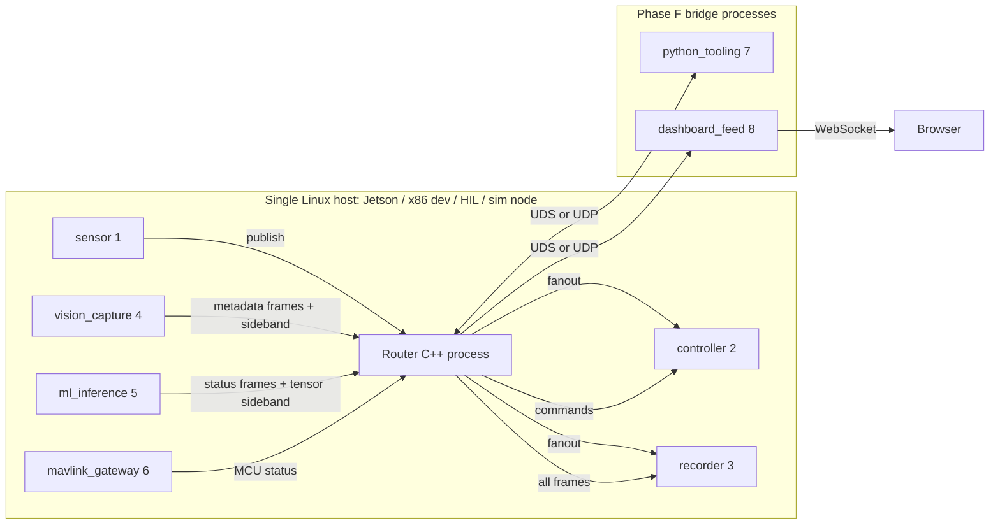

# Robotics reference layout

> **Phase E E1 deliverable.** Reference deployment shape for the IPC router and its peer processes across Jetson on-robot, x86 dev, HIL bench, and sim / CI cloud targets. Companion to [SYSTEM-VISION.md](../robotics-ipc-module/SYSTEM-VISION.md) (the north-star) and the per-profile TOML files under [config/profiles/](../config/profiles/).

## Purpose

This document tells someone deploying or extending the module:

- **Which peers** can run on the same router instance (catalog + IDs + data class).
- **Which transport** each peer typically uses on each deployment target.
- **What goes in the inline 32 B payload vs the sideband regions** (control plane vs bulk).
- **Where the seams are** between the router (C++ core) and peers (separate processes, any language).
- **What is documented today vs deferred** — explicit pointers to Phase F deliverables and the [post-phases robotics-integration review](../robotics-ipc-module/plans/post-phases-robotics-review.md).

It does **not**:

- Provide TensorRT, CUDA, V4L2, GStreamer, or MAVLink code (those live in user processes — see Phase F sketches).
- Claim safety-critical certification ([ADR 0004](adr/0004-robotics-module-boundaries.md) §Out of scope).
- Replace per-profile TOML — the profiles under [config/profiles/](../config/profiles/) remain the source of truth for addresses and ring sizing.

## Scope vs deferred

This is a **deployment-shape document**. It documents the contract surface (peer catalog, frame fields, sideband regions, resource paths) but does **not** ship integration code. The following are deliberately out of scope here:

| Topic | Where it lives |
|-------|----------------|
| `sd_notify` / systemd readiness | Beyond Phase E2 ([deploy/systemd/](../robotics-ipc-module/deploy/systemd/) ships `Type=simple` units; readiness signaling deferred — see parked review C6) |
| Cross-host time correlation | Beyond Phase E4 ([ADR 0010](adr/0010-router-timestamp-clock.md) lands `CLOCK_MONOTONIC_RAW` for single-host scope; cross-host delegated to user code or a future dedicated recorder — see parked review C8) |
| Python / Node / MAVLink bridge code | Phase F F2–F4 |
| Vision peer + camera capture code | Phase F F5 |
| Sideband `memory_class` (CUDA / NvBufSurface) parsing | Phase F (forward-declared in [ADR 0008](adr/0008-router-frame-v2.md)) |
| TensorRT contract beyond peer-catalog level, replay/sim peer, declarative-transport extensions (per-topic routes — **delivered as [Phase G](../robotics-ipc-module/plans/G-declarative-routing.md)**; priority-aware QoS — merged into C7), mixed-transport networks (SHM + UDS + UDP from one router), RT pinning / `mlockall`, aarch64 CI dimension, `make install` / CMake export | Open backlog — see [plans/post-phases-robotics-review.md](../robotics-ipc-module/plans/post-phases-robotics-review.md) (considerations C1–C11; C5 Scopes A + B closed 2026-05-28; C5 Scope C promoted to [Phase G](../robotics-ipc-module/plans/G-declarative-routing.md) — **delivered 2026-06-01, [ADR 0013](adr/0013-per-topic-routing.md)** — and Scope D merged into C7 on 2026-05-30) |

## Peer catalog

Peer IDs are byte-valued (1–255) and stable across deployment profiles per the swapping rule in [SYSTEM-VISION.md](../robotics-ipc-module/SYSTEM-VISION.md#deployment-targets). Names are configured in topology TOML.

| ID | Name | Role | Inline frame use | Sideband use | Status today |
|----|------|------|------------------|--------------|--------------|
| 1 | `sensor` | Proprioceptive / IMU aggregate; periodic publish | `topic_id`, `seq`, ≤32 B payload | none | Demo binary (`router_client sensor`) |
| 2 | `controller` | Control loop; subscribes sensor, publishes commands | `topic_id`, `seq`, ≤32 B payload | optional (see `jetson_prod.toml`) | Demo binary (`router_client controller`) |
| 3 | `recorder` | Black-box log; subscribe-all | reads everything; writes log | none | Demo binary (`router_client recorder`); CSV format — **not playback-compatible** (see C4 in parked review) |
| 4 | `vision_capture` | CSI/V4L camera pipeline | metadata only (`topic_id`, `seq`, `timestamp_ns`, sideband descriptor) | NV12 / JPEG via sideband region (`nvbufsurface` on Jetson, `shm` on x86) | **Interface + `memory_class` parser ([ADR 0012](adr/0012-sideband-memory-class.md))** — Phase F F5; capture binary deferred |
| 5 | `ml_inference` | CUDA inference (e.g. TensorRT) | metadata + tensor descriptor | input + output tensors via sideband region (`cuda_managed` on Jetson, `shm` on x86) | **Interface + `memory_class` parser ([ADR 0012](adr/0012-sideband-memory-class.md))** — Phase F F5; TensorRT engine deferred (parked C1) |
| 6 | `mavlink_gateway` | MCU bridge over UART (MAVLink v2 stream parsed → one RouterFrame per message) | compact status frames (mode, attitude, ack) | optional `mavlink_bulk` for param dumps | **Interface + ADR ([0011](adr/0011-device-bridge-transports.md))** — Phase F F4; binary deferred ([`examples/bridges/mavlink_gateway/`](../examples/bridges/mavlink_gateway/)) |
| 7 | `python_tooling` | Training / scripts; offline batch | matches v2 frame layout via ctypes | optional | **Implemented** — Phase F F2 ([`examples/bridges/python_peer/`](../examples/bridges/python_peer/)) |
| 8 | `dashboard_feed` | Node UDP → WebSocket gateway (stdlib, no `npm install`) | reads everything; forwards to browser as JSON | none | **Implemented** — Phase F F3 ([`examples/bridges/node_gateway/`](../examples/bridges/node_gateway/)) |

**Frame layout** (64 B, host little-endian) per [ADR 0008](adr/0008-router-frame-v2.md):
`source` (u8) · `flags` (u8) · `topic_id` (u16) · `seq` (u32) · `timestamp_ns` (u64) · `sideband_idx` (u8) · `sideband_len` (u48) · `sideband_seq` (u8) · 32 B inline payload.

## Topology overview

The router is a single in-process forwarder per host. Same peer IDs and route rules in every profile; only addresses and ring sizing change.



**Per-deployment profile mapping** (Phase F F1 — see [docs/deployment-profiles.md](deployment-profiles.md) for the operator-facing breakdown):

| Profile | Transport | Listen address | Resource prefix |
|---------|-----------|----------------|-----------------|
| [config/profiles/jetson_prod.toml](../config/profiles/jetson_prod.toml) | SHM (all 6 peers) | `shm:/rim_router` | `/dev/shm/rim_router_*` + sideband `/dev/shm/rim_vision_*` / `rim_ml_*` |
| [config/profiles/x86_dev.toml](../config/profiles/x86_dev.toml) | UDS (all 6 peers) | `uds:/tmp/rim_router.sock` | `/tmp/rim_router_*.sock` |
| [config/profiles/hil.toml](../config/profiles/hil.toml) | UDP loopback | `udp:127.0.0.1:19100` | ports 19100–19108 (19106/19107 reserved for F4/F2) |
| [config/profiles/sim_cloud.toml](../config/profiles/sim_cloud.toml) | UDP | `udp:10.0.0.1:19200` (placeholder) | ports 19200–19208 across container subnet |

## Per-deployment shapes

### Jetson on-robot (NVIDIA Jetson, L4T)

**Transport.** Per-peer SHM SPSC rings under `/dev/shm/rim_router_*`. Each control-plane ring is sized to one cache line per slot (`shm_max_payload = 64`) × 256 slots ≈ 35 KiB per direction per peer ([ADR 0009](adr/0009-per-peer-ring-sizing.md)). Sideband regions are independent SHM segments sized for bulk payloads (8 MB NV12 frame, 16 MB ML tensor — see [`jetson_prod.toml`](../config/profiles/jetson_prod.toml)).

**Process layout** (deployment-time recommendation):

| Process | Started by | Notes |
|---------|-----------|-------|
| `router_server --config jetson_prod.toml` | systemd ([`rim-router.service`](../robotics-ipc-module/deploy/systemd/rim-router.service)) | Binds + unlinks SHM regions; idle CPU ~1.5–1.7 % single core ([ADR 0007](adr/0007-router-idle-wake.md)) |
| Sensor / controller / recorder C++ peers | systemd [`rim-peer@.service`](../robotics-ipc-module/deploy/systemd/rim-peer@.service) instances, `After=rim-router.service` | First connect can race router bind — see [parked review C6](../robotics-ipc-module/plans/post-phases-robotics-review.md#c6--systemd-readiness-signaling-sd_notify--typenotify); user-side retry-with-backoff recommended until `sd_notify` lands |
| `vision_capture` (Phase F) | systemd unit | Publishes metadata frame to router; writes NV12 to `/dev/shm/rim_vision_nv12` sideband |
| `ml_inference` (Phase F) | systemd unit | Reads `/dev/shm/rim_ml_tensor_in`, writes `/dev/shm/rim_ml_tensor_out`; CUDA / TensorRT engine is the **user's** code, not the module's |
| `mavlink_gateway` (Phase F) | systemd unit; needs `/dev/ttyUSB*` device access | Parses MAVLink, publishes compact status to router |

**Operational knobs.** None of the following are enabled by default; they belong in the user's systemd unit:

- `MemoryLock=infinity` — pin pages to avoid faults under load (recommended; see [parked review C7](../robotics-ipc-module/plans/post-phases-robotics-review.md#c7--real-time--production-knobs-mlockall-cpu-pinning-sched_fifo))
- `CPUAffinity=` — pin router to an isolated core
- `LimitRTPRIO=80` — enable `SCHED_FIFO` from inside the router (router does not call `sched_setscheduler` today; this is a knob for user code wrapping the router)

**Cleanup.** SHM regions persist across router crashes by design (router unlinks-then-creates on next start). Manual cleanup recipe in [scripts/README.md](../robotics-ipc-module/scripts/README.md). The [`shm_leak_check.sh`](../robotics-ipc-module/scripts/shm_leak_check.sh) gate verifies test suites leave no leftover `/dev/shm/rim_*` or `/tmp/rim_*.sock`.

### x86 dev (Linux laptop / workstation)

**Transport.** UDS sockets under `/tmp/rim_router_*.sock` ([`x86_dev.toml`](../config/profiles/x86_dev.toml)). Same peer IDs and route rules as Jetson; only addresses differ.

**Process layout.** Typically the developer runs `router_server --config config/profiles/x86_dev.toml` in one terminal and the demo peers (`router_client sensor` / `controller` / `recorder`) in others. Phase F bridges (Python / Node) connect over the same UDS paths.

**Notes.**

- No SHM means no `/dev/shm/rim_*` artifacts to clean up; just delete `/tmp/rim_router_*.sock` if a process crashes mid-bind. The router unlinks-then-binds, so a fresh start is enough in most cases.
- `x86_dev.toml` declares the same `vision_capture` (4) and `ml_inference` (5) sideband regions as `jetson_prod.toml`, but with `memory_class = "shm"` (a dev laptop has no Orin iGPU / NvBufSurface). This demonstrates the [ADR 0012](adr/0012-sideband-memory-class.md) point: sideband regions are SHM/host segments **independent of the control transport** (UDS here), and only the `memory_class` differs between the dev and prod profiles — the bridge code is identical.

### HIL bench

**Transport.** UDP on `127.0.0.1` ([`hil.toml`](../config/profiles/hil.toml)). Plant / sensors / actuators are replaced by mock processes binding the same UDP ports.

**Status today.** The profile exists and validates; **mock processes do not exist** — Phase F F2/F4 examples are the intended source. See [parked review C4](../robotics-ipc-module/plans/post-phases-robotics-review.md#c4--playback--simulation-testing-on-x86) for the broader gap on playback / simulated inputs.

**Failure modes documented in [fault_injection_test.cpp](../ipc/test/fault_injection_test.cpp):**

- Truncated UDP datagrams → `DatagramRouterMetrics::recv_truncated`
- Unknown-source UDP frames → `DatagramRouterMetrics::recv_unknown_source`
- Wrong UDS path → clean throw
- Stale socket file rebind → recovered by `Uds::bind` unlink-then-bind

### Sim / CI cloud

**Transport.** UDP across a container subnet ([`sim_cloud.toml`](../config/profiles/sim_cloud.toml); the `10.0.0.x` addresses are placeholders the orchestrator overrides). Cross-host SHM is **not** supported ([ADR 0005](adr/0005-payload-policy-and-sideband.md), [SYSTEM-VISION.md](../robotics-ipc-module/SYSTEM-VISION.md#out-of-scope-for-the-whole-system-this-repos-module)).

**CI.** [.github/workflows/ci.yml](../.github/workflows/ci.yml) runs the unit + integration + router scenarios on x86_64 ubuntu-latest with `ccache`. Aggregate end-to-end < 1 min. aarch64 / Jetson is not currently a CI dimension — see [parked review C3](../robotics-ipc-module/plans/post-phases-robotics-review.md#c3--arm--aarch64-verification).

## Integration patterns

The router stays transport-only. Every domain integration (camera, ML, serial) is a separate peer process matching the [ADR 0008](adr/0008-router-frame-v2.md) wire layout. Stub directories for the Phase F bridges are scaffolded under [`examples/bridges/`](../examples/bridges/) — see the [bridges index](../examples/bridges/README.md) for the principles and the per-bridge stubs for contract pointers.

### Vision capture (`vision_capture`, peer 4)

**Status:** interface + `memory_class` parser shipped 2026-05-31 ([ADR 0012](adr/0012-sideband-memory-class.md), Phase F F5); the camera capture binary is deferred (it needs Argus / V4L2 / CUDA SDKs the core excludes per [ADR 0004](adr/0004-robotics-module-boundaries.md)). See [`examples/bridges/vision_peer/README.md`](../examples/bridges/vision_peer/README.md) for the full F5 interface. The reference layout below is the contract a user-written `vision_capture` peer should follow.

**Process shape.**

- Separate binary. Owns `/dev/video*` (USB UVC), `/dev/v4l-subdev*` (CSI), or NVMM buffers (Jetson `nvarguscamerasrc`).
- Encodes each captured frame into a sideband region (NV12 raw or JPEG compressed).
- Publishes a [RouterFrame v2](adr/0008-router-frame-v2.md) on the control plane with:

| Field | Use |
|-------|-----|
| `source` | 4 (`vision_capture`) |
| `flags` | `keyframe` bit for I-frames; `has_sideband` bit always set |
| `topic_id` | Camera index (e.g. 0x10 left, 0x11 right) |
| `seq` | Monotonic per-camera frame counter |
| `timestamp_ns` | Capture time per [ADR 0008](adr/0008-router-frame-v2.md) field semantics; clock is [`CLOCK_MONOTONIC_RAW`](adr/0010-router-timestamp-clock.md) — peers stamp via `router_now_ns()` from [`router/timestamp.hpp`](../ipc/src/router/timestamp.hpp) for single-host comparability with router-stamped frames |
| `sideband_idx` | Index into the peer's `[[peers.sideband]]` array |
| `sideband_seq` | Producer's slot index in the sideband ring (subscriber reads it back) |
| `sideband_len` | Bytes valid in the slot (`u48`, up to 256 TB) |
| Inline 32 B payload | Compact metadata: width, height, exposure, drop counter — **not** pixel data |

**Sideband region.** Configured in topology TOML under the peer's `[[peers.sideband]]` block. Example (from [`jetson_prod.toml`](../config/profiles/jetson_prod.toml) vision_capture entry):

```toml
[[peers.sideband]]
class             = "vision_nv12"
name              = "/rim_vision_nv12"
max_payload_bytes = 8388608
memory_class      = "nvbufsurface"   # ADR 0012 — Argus / V4L2 DMA-buf
cuda_device       = 0                # integrated GPU
```

`name` / `max_payload_bytes` / optional `version` / **`memory_class`** / **`cuda_device`** are all parsed by the loader. `class` remains informational. The `memory_class` field — `shm` (default) / `cuda_managed` / `cuda_host` / `nvbufsurface` — was forward-declared in [ADR 0008](adr/0008-router-frame-v2.md) and is **realized as of [ADR 0012](adr/0012-sideband-memory-class.md)** (Phase F F5, closing the loader portion of [parked review C2](../robotics-ipc-module/plans/post-phases-robotics-review.md#c2--cuda--sideband-memory_class-parsing)). A consumer reads `memory_class` from the topology entry its `sideband_idx` points at and picks the access path: `shm` → `mmap`; `cuda_managed` → dereference the managed pointer; `cuda_host` → pinned host pointer; `nvbufsurface` → `cudaImportExternalMemory` the DMA-buf (GPU) or the surface's mapped CPU pointer. The same bridge binary runs on `x86_dev.toml` (`memory_class = "shm"`) and `jetson_prod.toml` (`nvbufsurface`) with no code change — the GPU mapping code (which links CUDA) stays in the deferred capture binary, never in `ipc/src/`.

### ML inference (`ml_inference`, peer 5)

**Status:** interface + `memory_class` parser shipped (F5, [ADR 0012](adr/0012-sideband-memory-class.md)) — co-resident with the vision peer stub at [`examples/bridges/vision_peer/`](../examples/bridges/vision_peer/) (F5 covers both peers' contract surface). The `ml_tensor_in` / `ml_tensor_out` sidebands declare `memory_class = "cuda_managed"` on `jetson_prod.toml`. TensorRT / CUDA engine implementation is the **user's** code (parked [C1](../robotics-ipc-module/plans/post-phases-robotics-review.md#c1--tensorrt-integration-contract)); the module provides transport for the input/output tensors and the memory-class vocabulary to access them.

**Process shape.**

- Separate binary. Subscribes to vision metadata frames from peer 4 (or directly from the route configured for ML).
- For each frame: maps the sideband region indexed by `frame.sideband_idx()`, reads `sideband_seq` to find the slot, then copies or zero-copies the input tensor according to the region's `memory_class` ([ADR 0012](adr/0012-sideband-memory-class.md) — `cuda_managed` on Jetson enables the zero-copy path; `shm` on x86 dev is a CPU `memcpy`).
- Runs inference.
- Publishes a result `RouterFrame` with inline metadata (class id, confidence, latency_ns) and writes the full output tensor into a separate sideband region (`ml_tensor_out`).

**Contract on RouterFrame fields:** same as `vision_capture` but `source = 5` and `topic_id` distinguishes input vs output streams. Subscribers can route by `source` (per-source) or by `(source, topic_id)` as of [Phase G — Declarative routing](../robotics-ipc-module/plans/G-declarative-routing.md) ([ADR 0013](adr/0013-per-topic-routing.md), delivered 2026-06-01): a `[[routes]]` entry may carry an optional `topic` selector so, e.g., a consumer subscribes only to the `ml_result` output topic (id 400) and not the input tensor stream. The `topic` references an id in the optional `[[topics]]` registry ([closed C5 Scope B](../robotics-ipc-module/plans/post-phases-robotics-review.md#closure--scope-b-declarative-topic-registry-2026-05-28)), which also lets bridges validate `topic_id` against a declared name + payload class.

### MAVLink gateway (`mavlink_gateway`, peer 6)

**Status:** interface + ADR ([0011](adr/0011-device-bridge-transports.md)) shipped 2026-05-31; working binary deferred per the [F4 plan](../robotics-ipc-module/plans/F-interoperability-bridges.md#f4--mavlink-gateway-sketch). See [`examples/bridges/mavlink_gateway/README.md`](../examples/bridges/mavlink_gateway/README.md) for the locked interface (peer-id reservation, profile shape, inline payload schema for `HEARTBEAT` / `ATTITUDE` / `SYS_STATUS` / `STATUSTEXT` / `COMMAND_ACK`, command flow, systemd serial-device permissions).

**Transport (bridge → router): UDS `SOCK_DGRAM`** per [ADR 0011 §UART / MAVLink](adr/0011-device-bridge-transports.md#uart--mavlink--uds-sock_dgram-peer-6-the-f4-worked-example). The bridge parses the MAVLink stream into discrete messages and emits one `RouterFrame` per message; `SOCK_STREAM` passthrough was considered and rejected (would require new router transport support, breaks `peer_id_from_recv` source resolution, and re-streamifies after the bridge already parsed). The same ADR also covers transport selection for SPI (→ SHM SPSC ring), I²C and CAN / CAN-FD (→ UDS dgram) so a downstream user adding any of those bridges follows the same shape.

**Process shape.**

- Separate binary, opens `/dev/ttyTHS*` on Jetson or `/dev/ttyUSB*` on x86 dev (or UDP to a MAVLink simulator like ArduPilot SITL / PX4 SITL).
- Parses MAVLink v2, packs the relevant fields of each message into the 32 B inline payload using a schema documented in `frame_layout.h`; puts the MAVLink `msgid` in `RouterFrame.topic_id` so subscribers dispatch without re-parsing MAVLink.
- Subscribes to a command route from the controller (peer 2) and translates each received `RouterFrame` back into a MAVLink message it writes to the UART. Rate-limits to the MCU's actual ingest rate — the router is rate-agnostic.
- Optional secondary UDP listener for ground-station tools (QGroundControl); that listener is **inside the gateway**, not in the router.
- `mavlink_bulk` sideband region per [ADR 0005](adr/0005-payload-policy-and-sideband.md) is optional for parameter dumps / log replay that exceed the inline 32 B; F4 baseline omits it.

### Recorder (`recorder`, peer 3) — shipped

**Status:** demo binary today (`router_client recorder`).

**Process shape.**

- Subscribes to broadcast routes from sensor (1) and controller (2).
- Appends one CSV line per received frame to a log file (`/tmp/rim_router_c.log` by default).

**Limitation.** The current CSV format captures only `source,timestamp_ns,payload` — insufficient for cadence-faithful replay (missing `topic_id`, `seq`, `flags`, sideband refs, bulk bytes). Documented as [parked review C4](../robotics-ipc-module/plans/post-phases-robotics-review.md#c4--playback--simulation-testing-on-x86); a binary tape format + replay peer is a backlog candidate, not in Phase E scope.

### Python bridge (`python_tooling`, peer 7)

**Status:** implemented — [`examples/bridges/python_peer/`](../examples/bridges/python_peer/) ships a UDS subscriber + publisher using `ctypes.LittleEndianStructure` to mirror the 64 B [ADR 0008](adr/0008-router-frame-v2.md) frame layout byte-for-byte. End-to-end wire compatibility is verified by [`smoke.sh`](../examples/bridges/python_peer/smoke.sh) (Python publisher → C++ router → Python subscriber with byte-exact payload comparison).

**Process shape.** Standalone Python process (any interpreter, stdlib-only — no third-party deps). Connects to the router on UDS (recommended on x86 dev) or UDP (HIL / cloud — UDP variant not in F2 deliverable; trivial extension by switching the socket family in [`rim_router_peer.py`](../examples/bridges/python_peer/rim_router_peer.py)). The router resolves the source peer from the sender's bound socket path, so the Python peer **must** `bind()` at the peer-7 path declared in the profile before sending — see the [bridge README](../examples/bridges/python_peer/README.md#how-the-router-identifies-a-python-peer) for the details and the Phase D4 `recv_unknown_source` counter that catches misconfiguration. **Do not** embed CPython in `libipc` — header-only C++ keeps the boundary clean ([ADR 0004](adr/0004-robotics-module-boundaries.md)).

### Node dashboard gateway (`dashboard_feed`, peer 8)

**Status:** implemented in [F3](../robotics-ipc-module/plans/F-interoperability-bridges.md#f3--node-dashboard-gateway-example) at [`examples/bridges/node_gateway/`](../examples/bridges/node_gateway/) — fully self-terminating `smoke.sh` runs a `publish.js → C++ router → gateway.js → ws_test_client.js` round-trip in ~2 s with byte-exact payload verification.

**Process shape.** Node.js (≥ 18) process; pure stdlib (no `npm install`, no third-party deps). UDP client to router, WebSocket server to browser. Decodes the inline 32 B payload + sideband metadata into JSON for the browser; the C++ router has no Node API surface — the gateway parses the frame layout itself via a Buffer-backed `RouterFrame` port with byte-offset self-checks that fail-fast on load if the C++ struct ever drifts from the [ADR 0008](adr/0008-router-frame-v2.md) table.

**Contract on `RouterFrame` fields:** as a subscriber, the gateway reads every field and serializes them into one JSON message per UDP frame — `source` / `source_name` / `flags` / `topic_id` / `seq` / `timestamp_ns` (router's `CLOCK_MONOTONIC_RAW`, ADR 0010, emitted as a string because JSON numbers are IEEE 754) / `sideband_idx` / `sideband_len` / `sideband_seq` / `payload_hex` / `payload_text`. The router resolves the source peer from the sender's UDP source `host:port` via [`peer_id_from_recv<Udp>`](../ipc/src/router/datagram_peer_resolver.hpp), so the gateway **must** `bind` at the peer-8 host:port declared in the profile before sending — see [the bridge README](../examples/bridges/node_gateway/README.md#how-the-router-identifies-the-gateway) and the Phase D4 `recv_unknown_source` counter that catches misconfiguration.

**Transport reachability.** Node's stdlib `dgram` module supports only UDP. The F3 gateway works out of the box against `hil.toml` and `sim_cloud.toml` (UDP profiles). For `x86_dev.toml` (UDS) the gateway needs either the [`unix-dgram`](https://www.npmjs.com/package/unix-dgram) npm package or a small profile variant that swaps peer 8 to UDP. For `jetson_prod.toml` (SHM) the gateway is not reachable — parked under [C11 mixed-transport networks](../robotics-ipc-module/plans/post-phases-robotics-review.md#c11--mixed-transport-networks); the practical fix is running the gateway on x86 and forwarding via UDP. **Do not** embed Node in `libipc` — header-only C++ keeps the boundary clean ([ADR 0004](adr/0004-robotics-module-boundaries.md)).

## Operational notes

### Time semantics

The router stamps `timestamp_ns` with `CLOCK_MONOTONIC_RAW` per [ADR 0010](adr/0010-router-timestamp-clock.md). Properties:

- **Single-host, since-boot.** Comparable across processes on the same host within a boot epoch.
- **Slew-free.** Unaffected by NTP / `adjtime` — control-loop deadlines computed from frame timestamps don't see spooky jitter.
- **Survives router restart.** systemd `Restart=on-failure` does not reset the clock; subscribers can latch monotonically across router lifetime.
- **Resets on reboot. Not comparable across hosts.**

User peers that want to stamp their own frames with the same clock include [`router/timestamp.hpp`](../ipc/src/router/timestamp.hpp) and call `router_now_ns()`.

**Cross-host correlation is delegated** ([ADR 0010 §Out of scope](adr/0010-router-timestamp-clock.md)):

- **Application-level.** A peer that needs cross-host (HIL, sim_cloud) time correlation adds its own clock reading (PTP-anchored, sim-time, wall clock) inside its custom 32 B payload or in a sideband region. The router transports those bytes opaquely.
- **Future dedicated recorder module.** A stateful recorder — the kind needed for replay per [parked review C4](../robotics-ipc-module/plans/post-phases-robotics-review.md#c4--playback--simulation-testing-on-x86) — is the natural home for richer time semantics (PTP, capture-time, host clock skew tracking). Its relaxed latency / statelessness requirements make it the right place to absorb the complexity that the hot-path router refuses.

See also [parked review C8](../robotics-ipc-module/plans/post-phases-robotics-review.md#c8--cross-host-time-sync-ptp--ntp) — single-host portion is closed by ADR 0010; cross-host portion remains in the backlog as a *delegation*, not a deferred deliverable.

### Process supervision

systemd unit examples ship in [`robotics-ipc-module/deploy/systemd/`](../robotics-ipc-module/deploy/systemd/): [`rim-router.service`](../robotics-ipc-module/deploy/systemd/rim-router.service) (started first, owns SHM region lifecycle), [`rim-peer@.service`](../robotics-ipc-module/deploy/systemd/rim-peer@.service) (template; `%i` = `sensor` / `controller` / `recorder`; `After=`+`Requires=` the router), and [`rim-router-cleanup.sh`](../robotics-ipc-module/deploy/systemd/rim-router-cleanup.sh) (`ExecStopPost=` helper). See the [deploy/systemd/README.md](../robotics-ipc-module/deploy/systemd/README.md) for install steps, customization knobs, and known limitations.

### Idle CPU

`router_server` sleeps `RouterRunOptions::idle_sleep_us` (default 1 ms) between empty polls ([ADR 0007](adr/0007-router-idle-wake.md)). Measured idle ≈ 1.5–1.7 % single core on Jetson profile. The [`idle_cpu_check.sh`](../robotics-ipc-module/scripts/idle_cpu_check.sh) gate enforces ≤ 5 %.

### Restart and recovery

Router unlinks-then-creates SHM regions on bind. UDS bind unlinks the socket path before listening. Datagram links rebind cleanly after `SO_REUSEADDR`. Verified by [router_restart_test.cpp](../ipc/test/router_restart_test.cpp) and [fault_injection_test.cpp](../ipc/test/fault_injection_test.cpp).

### Resource cleanup

Stale resources occasionally outlive a hard kill. Recovery recipes:

```sh
sudo pkill -KILL -f "build/ipc/test/router_server"   # kill orphans (last resort; documented in LESSONS-LEARNED.md)
rm -f /dev/shm/rim_router_* /tmp/rim_router_*.sock /tmp/rim_router_*.log
```

The [`shm_leak_check.sh`](../robotics-ipc-module/scripts/shm_leak_check.sh) script is the regression gate (delta == 0 across unit + integration + router suites).

## Forward references

| Topic | Where it lands |
|-------|----------------|
| systemd unit files | [robotics-ipc-module/deploy/systemd/](../robotics-ipc-module/deploy/systemd/) (Phase E E2) |
| Bridge pointers / scaffolding | [examples/bridges/](../examples/bridges/) (Phase E E3 scaffolding) |
| Timestamp clock | [ADR 0010](adr/0010-router-timestamp-clock.md) — `CLOCK_MONOTONIC_RAW` single-host; cross-host delegated (Phase E E4) |
| Profile templates + `deployment-profiles.md` | [docs/deployment-profiles.md](deployment-profiles.md) — Phase F F1 + F2 + closed C5 Scopes A + B + Phase G (4 profiles × 7 peers; routes fan out to up to `kMaxRouteDests = 8`; optional `[[topics]]` registry; optional per-topic `topic` selector on `[[routes]]` — [ADR 0013](adr/0013-per-topic-routing.md); only the single-transport-per-router limitation remains open, cross-referenced to parked C11) |
| Python / Node / MAVLink / vision peer code | [Phase F F2–F5](../robotics-ipc-module/plans/F-interoperability-bridges.md) (F2 shipped in [`examples/bridges/python_peer/`](../examples/bridges/python_peer/); F3 shipped in [`examples/bridges/node_gateway/`](../examples/bridges/node_gateway/); F4 shipped as interface + [ADR 0011](adr/0011-device-bridge-transports.md) in [`examples/bridges/mavlink_gateway/`](../examples/bridges/mavlink_gateway/); F5 shipped the `memory_class` parser + [ADR 0012](adr/0012-sideband-memory-class.md) + interface in [`examples/bridges/vision_peer/`](../examples/bridges/vision_peer/) — the camera capture + CUDA mapping binaries remain user/downstream code per ADR 0004) |
| Open considerations (TensorRT contract depth, CUDA `memory_class`, ARM CI, playback peer, declarative-transport extensions, RT pinning, cross-host time, camera shape, consumption model) | [plans/post-phases-robotics-review.md](../robotics-ipc-module/plans/post-phases-robotics-review.md) |
