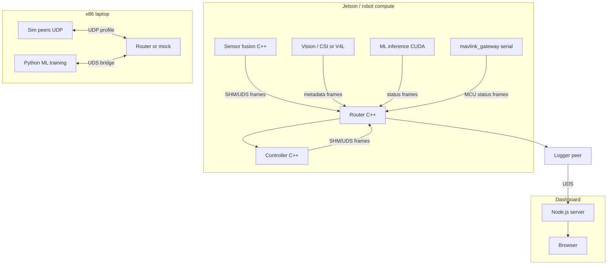

# System vision — Where this IPC module fits

**Non–safety-critical** robotics stack on Linux. This document is the **north star** for phases B, E, and F. The C++ module provides **routing + framing**; neighbors are separate processes.

---

## Deployment targets

| Target | Hardware | Typical IPC profile | Notes |
|--------|----------|---------------------|-------|
| **Embedded robot** | NVIDIA Jetson | `shm` peer rings + UDS debug | CSI cameras, CUDA inference local |
| **Dev laptop** | x86 + NVIDIA GPU | `uds` or `shm` + UDP to sim | Same topology file, different `PeerAddress` |
| **HIL bench** | x86 | `udp` loopback / `uds` | Replace plant with mock peers; same routes |
| **Cloud / CI sim** | Linux VM | `udp` to localhost | Sensor mocks; no SHM across machines |
| **Dashboard** | Browser (Node) | WebSocket gateway process | Not in C++ core |

**Swapping rule:** Peer IDs and `RouteRule[]` stay stable; only `PeerAddress` and `TransportKind` change per profile file.

---

## Logical architecture

---

## Peer catalog (illustrative)

Stable IDs (byte); names in topology file.

| ID | Name | Role | Data class |
|----|------|------|------------|
| 1 | `sensor` | Proprioceptive / IMU aggregate | Small periodic frames |
| 2 | `controller` | Control loop | Small frames + commands |
| 3 | `recorder` | Black box log | Subscribe-all |
| 4 | `vision` | Camera pipeline | **Metadata** in frame; **NV12/JPEG SHM** sideband |
| 5 | `ml_inference` | CUDA model | Metadata + tensor sideband |
| 6 | `mavlink_gateway` | MCU bridge | MAVLink parsed → status frames |
| 7 | `python_tooling` | Training/scripts | Bridge process |
| 8 | `dashboard_feed` | Node gateway | Bridge process |

Demo today implements 1–3 only. Phases B/E/F extend **documentation and examples**, not all peers at once.

---

## Transport profiles (config)

Example files under `config/profiles/` (Phase B/E):

| Profile | `transport_default` | Peer binding pattern |
|---------|---------------------|----------------------|
| `jetson_prod.yaml` | shm | High-rate on SHM; logger on UDS |
| `x86_dev.yaml` | uds | All local sockets under `/run/robot/` |
| `hil.yaml` | udp | `127.0.0.1` ports per peer |
| `sim_cloud.yaml` | udp | Ports for container network |

Router process reads profile + starts `TransportKind` per link or globally.

---

## Component integration patterns

### Cameras (web USB / CSI)

- **Process:** `vision_capture` (GStreamer / V4L2 / Jetson NVMM).
- **Router:** Sends `RouterFrame` metadata (frame_id, timestamp, exposure, drop_count).
- **Bulk video:** Separate named SHM region or DMA buffer export—**not** 32 B frame payload.

### Serial / MAVLink (microcontroller)

- **Process:** `mavlink_gateway` opens `/dev/ttyUSB*`.
- **Router:** Publishes compact status (mode, attitude summary, command ack); commands subscribe on controller route.
- **Raw MAVLink:** Stays inside gateway; optional secondary UDP for QGroundControl if needed.

### ML models (CUDA)

- **Process:** `ml_inference` on GPU; Python for training only.
- **Interop:** C++ peer for realtime; Python bridge for offline batch (Phase F).
- **Tensors:** Sideband SHM ring with larger `max_payload` or dedicated tensor region ADR.

### Python processes

- **Pattern:** `examples/bridges/python_peer/` — `pybind11` or socket client matching `RouterFrame` layout.
- **Do not** embed CPython in `libipc`.

### Node / JavaScript dashboards

- **Pattern:** `examples/bridges/node_gateway/` — UDS subscriber → WebSocket → browser.
- **Do not** add Node API to C++ headers.

---

## HIL / simulation / cloud

| Mode | What changes | What stays same |
|------|--------------|-----------------|
| **HIL** | Hardware peer → mock process; UDP ports | Route rules, frame format, peer IDs |
| **Simulation** | Time source may be stepped; optional `sim_clock` peer | Topology schema |
| **Cloud test** | Remote UDP endpoints; TLS optional later | Contract tests on frame codec |

Provide `topology.hil.yaml` that points `sensor` to mock port 19101, etc.

---

## Phases mapped to vision

| Phase | Vision contribution |
|-------|---------------------|
| A | MODULE.md lists Jetson + x86; bridge code excluded from core |
| B | Profile YAML; payload/sideband ADR for vision/ML |
| C | SHM suitable for Jetson camera-adjacent throughput |
| D | Soak + fault tests before field |
| E | systemd on Jetson; reference peer layout |
| F | Python/Node/MAVLink bridge examples; profile templates |

---

## Out of scope for the whole system (this repo’s module)

- Autopilot safety guarantees
- Replacing MAVLink with router frames on the wire to MCU
- Running router inside browser or Python GIL
- Cross-machine SHM (use UDP profile instead)
