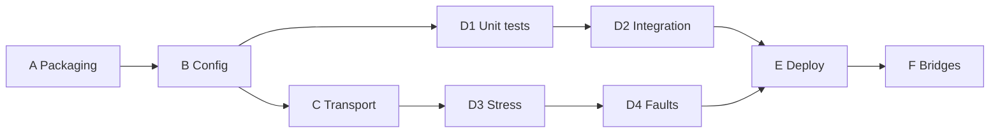

# Master plan — Robotics IPC module

**Scope:** Non–safety-critical robotics on Linux (Jetson embedded, x86 + CUDA dev, HIL/sim/cloud).  
**Goal:** C++ **message fabric** that swaps IPC backends per environment and bridges to Python, Node, cameras, and MAVLink—without bloating core headers.

**Read first:** [DESIGN-PRINCIPLES.md](../DESIGN-PRINCIPLES.md) · [SYSTEM-VISION.md](../SYSTEM-VISION.md) · [LESSONS-LEARNED.md](../LESSONS-LEARNED.md)

## Readiness snapshot

| Ready now | Not yet |
|-----------|---------|
| UDS/UDP/SHM multi-process router | Deployment profiles (jetson/hil/sim) |
| Transport-agnostic topology + factories | Sideband video/tensor SHM |
| SIGTERM-aware poll loops | Python/Node/MAVLink bridges |
| ADR 0001–0003 | CI, unit tests, latency SLOs |

## Phase map



| Phase | File | Est. | Depends on | Vision |
|-------|------|------|------------|--------|
| A | [A-module-packaging.md](A-module-packaging.md) | 1–2 wk | Tests green | Module boundary, ADR 0004 |
| B | [B-message-and-config.md](B-message-and-config.md) | 2–3 wk | A | Profiles, payload/sideband ADR |
| C | [C-transport-hardening.md](C-transport-hardening.md) | 2–4 wk | A | Jetson-grade SHM idle/backpressure |
| D | [D-validation-stress.md](D-validation-stress.md) | ongoing | B/C | HIL restart, soak |
| E | [E-robotics-integration.md](E-robotics-integration.md) | 1–2 wk | B2,C1,D2 | Jetson systemd, peer catalog |
| F | [F-interoperability-bridges.md](F-interoperability-bridges.md) | 2–3 wk | B1,E1 | Python, Node, MAVLink, camera metadata |

## Global acceptance (every phase)

```bash
make all
make test-ipc
make test-router
```

Plus phase-specific commands in each plan.

## Design principles (summary)

1. **Layers** — transport → adapters → link → node → app; no upward deps.
2. **Stable peer IDs** — swap addresses via profile YAML (HIL/sim/Jetson/x86).
3. **Fixed control frame + sideband** — 32 B for metadata/commands; bulk elsewhere.
4. **Interruptible I/O** — no signal-deaf blocking spin (see lessons learned).
5. **Bridges outside core** — Python, Node, GStreamer, serial not in `src/`.

Full list: [DESIGN-PRINCIPLES.md](../DESIGN-PRINCIPLES.md).

## Lessons learned (do not repeat)

- `if constexpr` **must use `else`** for SHM vs datagram dispatch.
- SHM: **one ring per peer**; idle-exit on empty `forward()`, not only exceptions.
- CLI log paths: **controller `argv[5]`** (uds/udp), **recorder `argv[4]`** — see [LESSONS-LEARNED.md](../LESSONS-LEARNED.md).

## Out of scope

- Safety certification, SIL, redundant routers
- In-core DDS, ROS 2, Node, Python, GStreamer
- TLS on localhost UDS (optional ADR for remote UDP)
- Bare-metal RTOS in this module
- Raw camera pixels or MAVLink bytes inside `RouterFrame` payload

## AI execution notes

1. Read DESIGN-PRINCIPLES + active phase plan each session.
2. Update [STATUS.md](../STATUS.md); append session log.
3. New decisions → `docs/adr/NNNN-*.md`.
4. Skills: `@ipc-robotics-phase-<letter>` or `@ipc-robotics-orchestrator`.

## Review themes (all phases)

| Theme | Question |
|-------|----------|
| Profile swap | Same peer IDs with `jetson_prod` vs `hil.yaml`? |
| Determinism | Idle CPU near zero on Jetson? |
| Interop | Bridge code only under `examples/bridges/`? |
| Vision | Camera/ML use sideband, not 22 B payload? |
| Ops | SIGKILL cleanup documented? |
